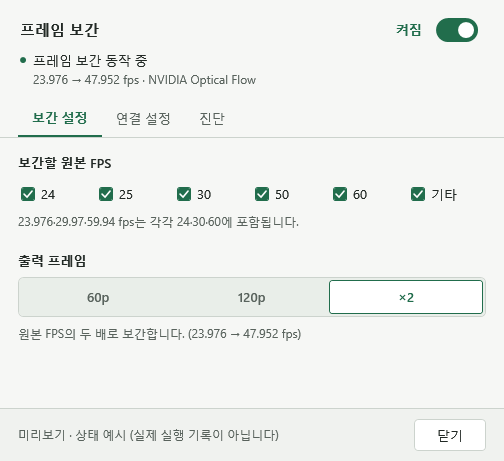

# NVOF for PotPlayer

**현재 설치형 미리보기: [v0.2.0-preview.9](https://github.com/mkyoon80-alt/nvof-potplayer/releases/tag/v0.2.0-preview.9)** · ×2 전용 · Windows x64

팟플레이어 내장 디코더·렌더러와 함께 사용하는 **NVIDIA Optical Flow 프레임 보간 필터**입니다. Windows x64용 DirectShow 필터와 작은 설정창으로 구성됩니다.

NVIDIA Optical Flow frame interpolation for PotPlayer, with a native D3D11 GPU path, seek-aware re-priming, and a compact controller. **Preview release — validated on an RTX 5090.**

## 기능

- NVIDIA NvOFFRUC를 사용하는 단일 보간 엔진
- **화질 보정** 탭: GPU 중간 프레임 보정·형태 변화 보호를 각각 켜고 끄기 (기본 둘 다 켜짐)
- **×2 전용** 출력: 23.976 → 47.952, 24 → 48, 30 → 60 fps
- 원본 FPS별 적용: **24 / 25 / 30 / 50 / 60 / 기타**
- 팟플레이어 **내장 디코더 + 내장 Direct3D 11 렌더러** 유지
- 네이티브 경로에서 프레임을 CPU RAM으로 되돌리지 않고 GPU에서 처리
- 앞뒤 탐색 후 이전 프레임 이력을 버리고 새 위치에서 보간 재시작
- VSR과 함께 사용 가능: **디코더 → 보간 → 렌더러의 VSR → 화면**
- 필터 속성에서 설정창 열기, 자체 영상 OSD 없음

원본 A와 B 사이의 중간 시점에 NvOFFRUC 프레임 하나를 생성합니다. 원본은 그대로 유지하고, 각 세션에 같은 입력을 반복 제출하지 않습니다. 장면 전환 또는 NVIDIA의 품질 보호 신호가 감지되면 해당 구간은 이전 원본을 유지합니다. 고정 60p·120p 모드는 제거했으며, 기존 설정 파일에 남아 있어도 ×2로 동작합니다.

## 다운로드와 설치

[**Windows x64 설치 프로그램 다운로드**](https://github.com/mkyoon80-alt/nvof-potplayer/releases/download/v0.2.0-preview.9/NvofPotPlayer-0.2.0-preview.9-Setup-x64.exe)

1. 팟플레이어와 NVOF 설정 창을 닫고 설치 프로그램을 실행합니다.
2. **NVIDIA 구성요소 이용 약관**을 확인하고 직접 동의합니다. 동의 항목은 기본 선택되지 않습니다.
3. 현재 사용자용 폴더에 설치하고 필터를 등록합니다. 필요한 .NET Desktop Runtime과 CUDA·Visual C++ 런타임은 포함되어 별도 설치가 필요하지 않습니다.
4. 팟플레이어에서 **F5 → 코덱/필터 → 전역 필터 우선 순위 → 시스템 코덱 추가 → NVIDIA Optical Flow for PotPlayer → 최우선 사용**으로 연결합니다.

Windows 10/11 x64, 지원 NVIDIA GPU·드라이버, 팟플레이어 x64는 별도로 필요합니다. **CUDA Toolkit이나 Visual Studio는 필요하지 않습니다.** 실행 파일은 코드 서명되지 않았습니다. 게시자 인증서와 새 PC 설치 검증의 범위는 릴리스 문서에서 확인하세요.

- [한국어 사용 설명서](docs/manual/index.html) — 설치 파일에도 포함되며 인터넷 없이 열립니다. GitHub에서는 HTML 소스가 보일 수 있으므로 설치 후 시작 메뉴의 **사용 설명서**를 열어 주세요.
- [텍스트로 읽는 팟플레이어 설정 방법](docs/POTPLAYER_SETUP.ko.md)
- [소스 빌드 및 설치 프로그램 제작](docs/BUILD.md)
- [릴리스 변경 내역·검증 범위](RELEASE.md)
- [처리 순서와 검증 범위](docs/ARCHITECTURE.md)

### NVIDIA 구성요소와 라이선스

프로젝트 자체 소스는 MIT입니다. **`NvOFFRUC.dll`과 CUDA·Microsoft 런타임은 MIT 대상에서 제외**되며 각 공급자의 조건이 적용됩니다. NVIDIA DLL은 앱 설치 프로그램 안에 포함하고 단독 다운로드는 제공하지 않습니다. `THIRD_PARTY_NOTICES.txt`와 원문 약관을 설치 폴더에 보존합니다.

이 배포는 공식 다운로드 페이지가 연결한 2017년 약관 1.1(ii)의 앱 포함 바이너리 배포 조항을 근거로 구성합니다. SDK에 동봉된 2022년 약관은 배포 범위를 다르게 표현하므로, **NVIDIA의 별도 서면 승인이나 두 약관 관계의 확정을 받았다고 주장하지 않습니다.** Click-through는 사용자 동의 절차이며 재배포 권한을 새로 만들어 주지 않습니다. [적용 자료·출처와 남은 해석 사항](licenses/README.md)을 함께 확인하세요.

설정 변경은 영상을 다시 열 때 적용됩니다. 프로그램은 선택한 설정과 실제 재생 상태를 구분해 표시합니다.

## 지원 범위

확인된 구성은 **Windows 10 x64, RTX 5090, 팟플레이어 x64 내장 디코더·내장 D3D11 렌더러**, 프로그레시브 **8비트 NV12 / BT.709 / 제한 범위 SDR**입니다. 이전 설치본에서 1080p ×2, VSR, 탐색, 종료를 확인했습니다. preview.8 적용 후 시험 사용자가 이전보다 크게 개선됐다고 확인했습니다. 전체 소스 빌드, 6개 기본 테스트, 52개 합성 품질 사례와 GPU·탐색·종료 검사를 통과했습니다. 다른 PC에서의 설치·실재생 검증은 아직 필요합니다.

HDR/P010, 인터레이스, 다중 GPU, 모든 코덱·해상도 조합에서의 장시간 안정성은 아직 보장하지 않습니다. 다른 GPU에서의 동작은 별도 검증이 필요합니다. Optical Flow 보간 특유의 경계 왜곡이나 장면 전환 시 반복 프레임이 발생할 수 있습니다. 60p·120p의 소수 시점에서 세부 무늬 떨림과 실험적 보정의 겹침 문제가 확인되어, 해당 출력 모드를 제거했습니다. ×2의 복잡한 움직임에서도 보간 왜곡이 완전히 사라지는 것은 아닙니다.

진단은 로컬에만 저장되며 자동 전송하지 않습니다. 문제를 제보할 때는 조작창 진단 내용, GPU/드라이버, 영상 형식, 재현 순서를 알려주세요. 개인 영상 파일은 필요하지 않습니다.

## License and acknowledgements

Original project source is under the [MIT license](LICENSE). Third-party binaries and source retain their separate licenses; they are **not** relicensed under MIT. See [third-party notices](THIRD_PARTY_NOTICES.md).

Built on Microsoft DirectShow baseclasses. The original adapter integration used rigaya's NVEncNVOFFRUC wrapper; the phase upgrade uses the project-built NvofFrucBridge with repetition metadata. The project uses public COM interface contracts for interoperability. It is an independent project, not affiliated with or endorsed by NVIDIA, PotPlayer, AMD, or Smootter. No Smootter binaries or proprietary source are included.

Slow-motion midpoint quality work and local validation: [preview 7 notes](docs/SLOW-MIDPOINT.md).

입 모양 변화와 카메라 이동 개선: [preview 8 검증 및 제한](docs/APPEARANCE-MOTION.md).
